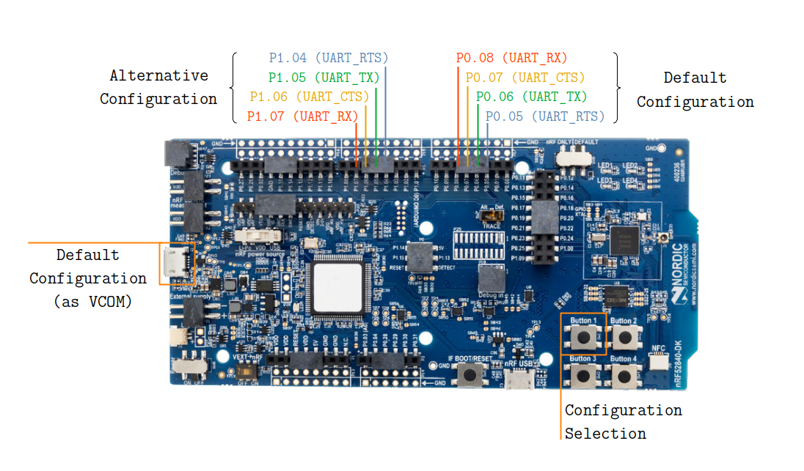
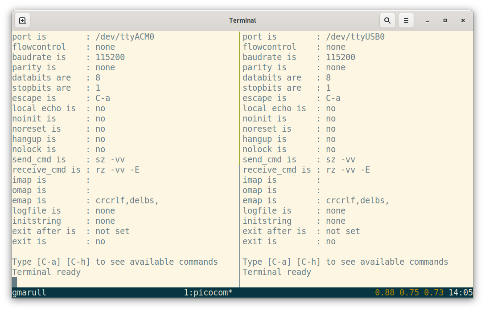
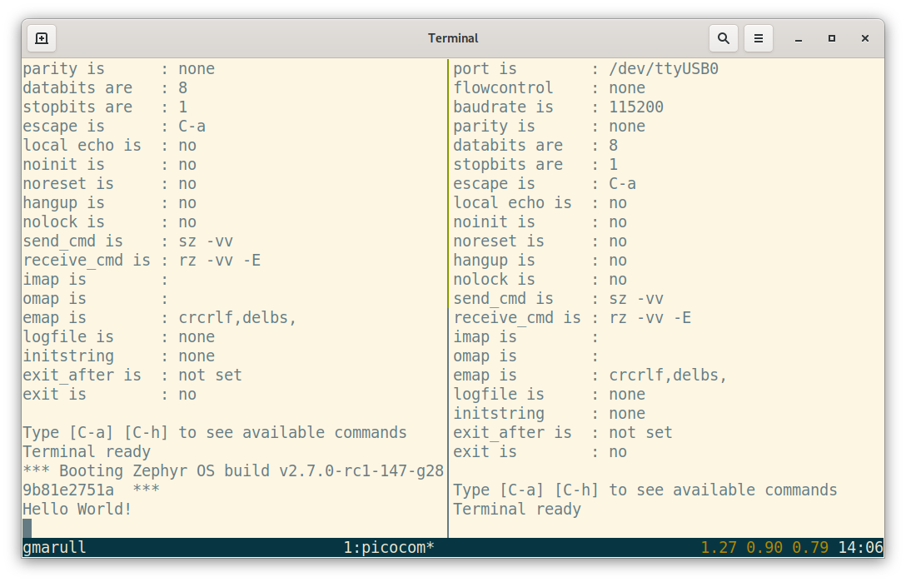
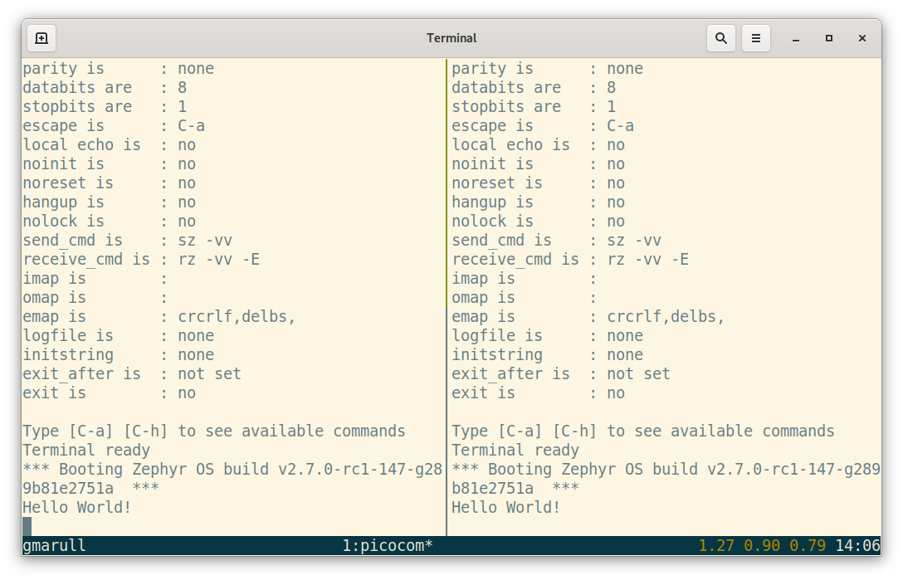

.. _samples_boards_nrf_dynamic_pinctrl:

Dynamic Pin Control (nRF)
#########################

Overview
********

It is sometimes necessary to have a firmware image that is able to boot onto
slightly different board revisions. Sometimes board revisions may just improve
the PCB layout or change components with new equivalents. In such cases, the
firmware does not usually require any changes. However, it could happen that
in a new or alternative board version, a certain peripheral is routed to a
different set of pins. This means that the firmware will need to select the
appropriate routing when the system is initialized.

This sample demonstrates how ``uart0`` pins can be changed at early boot stages
depending on the input level on a pin connected to a push button. If the push
button is not pressed, the system will do nothing and continue with the default
configuration. However, if the button is pressed, the alternative configuration
will be applied.

It is worth to note that alternative configurations can only be applied if the
device driver using the associated pins has not been initialized yet. Therefore,
it is important to pay attention to initialization priorities (see
:file:`prj.conf`).

nRF52840DK
==========

The diagram below shows the pins assigned to the default and alternative
configurations. If the user powers the board on the ``uart0`` peripheral will
be routed to the default set of pins. Note that the default set of pins is also
exposed via the left USB connector as a virtual COM port. If the user powers
the board on while holding Button 1, the ``uart0`` peripheral will be routed to
the alternative set of pins.

    Configuration for nRF52840DK

Building and Running
********************

This application can be built for nRF52840DK as follows:

.. zephyr-app-commands::
   :zephyr-app: samples/boards/nrf/dynamic_pinctrl
   :board: nrf52840dk_nrf52840
   :goals: build
   :compact:

Other nRF based boards can be supported if an appropriate Devicetree overlay
file is provided with the alternative configuration for ``uart0``. It is also
important to select ``uart0`` for ``zephyr,console`` to make the sample work as
expected.

Sample Output
=============

In order to test the two configurations, connect a USB to UART adapter to both
set of pins. If the board routes the default configuration to a virtual COM port
such as in nRF52840DK you can directly use that port.

First of all open two serial terminals, one connected to the default set of pins
and the other connected to the alternative set of pins.

    Two serial terminals (left: default, right: alternative)

Then, turn the board on. You should see a ``Hello World!`` message printed on
the first terminal.

    ``Hello World!`` printed on the default set of pins

Finally, press and hold the configuration selection push button (Button 1 on
nRF52840DK) and press the board reset button. You now should see a
``Hello World!`` message on the second terminal.

    ``Hello World!`` printed on the alternative set of pins
